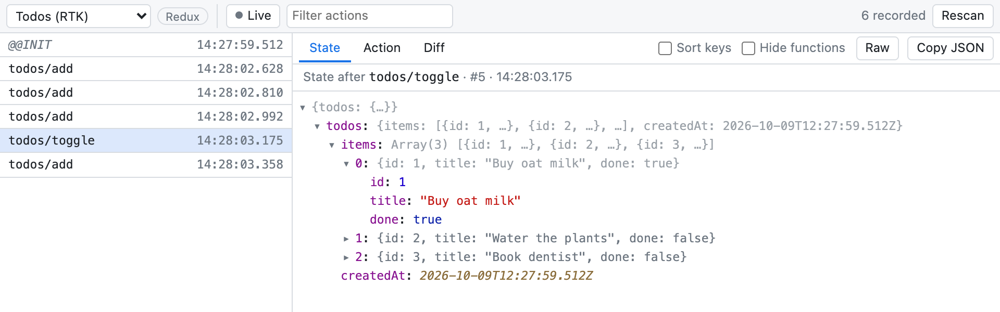
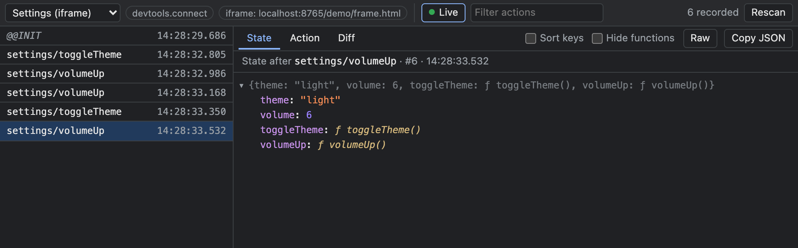

# Simple Redux DevTools

A small, **view-only** DevTools panel for Chrome and Firefox that shows the Redux and zustand stores on the current page: the action history, the state after each action, the action itself, and a diff of what changed.

It never dispatches actions, sets state or time-travels. It only looks.

No build step: the repository *is* the extension.



The **Diff** tab shows exactly what an action changed:

![The Diff tab: todos.items[0].done changed from false to true](docs/screenshots/diff.png)

To follow values through the history, hover over them in the **State** tab and click the pin. Pinned values are listed above the full state and update as you select different actions. If a value doesn't exist yet at an action, the panel says so. Click a pin again, or its ×, to unpin it. Switching stores clears the pins. Values inside Maps and Sets can't be pinned, because their entries have no stable key.

![The State tab with todos.items[0] and todos.items[1] pinned above the full state](docs/screenshots/pin.png)

Tick **Sort keys** to list object keys alphabetically in every view. Arrays, Maps and Sets keep their order, since it's part of the data. Tick **Hide functions** to leave out functions, such as zustand's actions. Press **Raw** to see any tab as plain text, written the way JavaScript would. Unlike JSON, it keeps `undefined`, functions, Maps, Sets and class names. Raw isn't sorted or filtered. The copy button follows the mode: **Copy raw** copies the text Raw shows, and **Copy JSON** copies JSON. Both leave functions out. All three settings are remembered.

Stores inside iframes appear too, with a badge naming the frame. The panel follows the DevTools dark theme:



<sub>Screenshots are from `demo/`.</sub>

## Install (unpacked)

**Chrome / Edge / Brave** (Chrome 121+)

1. Open `chrome://extensions` and turn on **Developer mode**.
2. Click **Load unpacked** and choose this folder.

**Firefox** (128+)

1. Open `about:debugging#/runtime/this-firefox`.
2. Click **Load Temporary Add-on…** and pick `manifest.json`.

   Temporary add-ons are removed when Firefox restarts. If the panel says it isn't connected, check that the extension is allowed to run on the site (Extensions → Simple Redux DevTools → Permissions). Iframes from other sites need that permission for their site too.

Then open DevTools on a page and choose the **Redux/Zustand** tab. Reload pages that were already open before you installed the extension.

## What gets picked up

| Source | How | Shows actions? |
| --- | --- | --- |
| Redux Toolkit `configureStore` | Uses the Redux DevTools compose hook (`devTools` is on by default, also in production) | yes |
| Redux `createStore(reducer, window.__REDUX_DEVTOOLS_EXTENSION__?.())` | Redux DevTools enhancer | yes |
| zustand `devtools(...)` middleware (and other libraries using `__REDUX_DEVTOOLS_EXTENSION__.connect`) | Redux DevTools `connect` API. zustand enables it in development by default | yes (named actions) |
| react-redux `<Provider store={…}>`, even with devtools disabled | Found by scanning the React fiber tree every few seconds, or with **Rescan** | state changes only |
| Anything else with `getState()` + `subscribe()` | `window.__SIMPLE_REDUX_DEVTOOLS__?.register(store, 'name')` | state changes only |

Stores inside iframes are picked up the same way, including iframes from other origins and nested ones. When any store lives in an iframe, the store picker groups stores by frame, and a badge shows which frame the selected store is in.

A plain zustand store, without the `devtools` middleware, can't be discovered from outside. Register it from your app instead. The hook returned by `create()` works directly:

```js
const useCart = create(set => ({ items: [] }));
window.__SIMPLE_REDUX_DEVTOOLS__?.register(useCart, 'cart');
```

## How it works

- `src/hook.js` is a content script that runs in the page's own JavaScript world (`"world": "MAIN"`) at `document_start`, before the app's code runs, in every frame of the page. It defines `window.__REDUX_DEVTOOLS_EXTENSION__` and `__REDUX_DEVTOOLS_EXTENSION_COMPOSE__`, which Redux, Redux Toolkit and zustand already look for. It records the last 100 states per store (or `maxAge` if the store sets one) as references, so recording copies nothing.
- `src/panel.js` polls twice a second while the panel is visible. It asks `src/background.js` to run the hook's `query()` in every frame of the inspected tab at once (`scripting.executeScript` with `allFrames`). Only the frame holding the selected store sends its history; the others just report changes to their store lists. Values are serialized only when the panel asks for them. That covers functions, `Map`/`Set`, `Date`, `undefined`, circular references, and oversized or very deep trees.
- Diffs compare object identity, which immutable Redux and zustand state makes cheap: unchanged subtrees are skipped without being walked.
- Each frame's data goes straight from that frame to the extension. Frames never pass it to each other inside the page, so a page can't use the extension to read the stores of a cross-origin iframe it embeds.
- See [Permissions](#permissions) for what the extension asks for and why.

**Using it next to the real Redux DevTools:** if that extension is installed too, this one forwards all calls to it, so both keep working.

## Permissions

| Permission | Why it's needed | Without it |
| --- | --- | --- |
| `host_permissions: ["<all_urls>"]` | Lets the background script read the hook in the inspected tab, including iframes from other sites. `scripting.executeScript` only works on sites the extension has access to. | The panel can't read any page. |
| `content_scripts` matching `<all_urls>`, in every frame | Injects `src/hook.js` before the app's own code runs, so it's in place when Redux or zustand look for the Redux DevTools. It has to be on every site because the extension can't know in advance which sites you'll inspect. | Stores are never recorded. Injecting the hook only when DevTools opens would be too late, because the stores already exist by then. |
| `scripting` | Lets the background script run the hook's `query()` in every frame of the tab at once. The DevTools APIs can't reach into a specific iframe in both browsers. | The panel can't read any page, not even the top frame, since all frames are read this way. |

When you install it, Chrome sums this up as *"Read and change all your data on all websites."* Site access always gets that wording, but this extension uses it narrowly:

- It only reads. The hook never dispatches actions or changes state, and the panel only calls `query()`.
- The hook keeps its records in the page's memory. They're read only while the panel is open and visible, and only by the panel.
- Nothing is sent anywhere. The extension makes no network requests and collects no data.
- It doesn't ask for `tabs`, `storage`, `cookies`, `webRequest` or any other permission. The action list's width is remembered in the panel's own `localStorage`, which needs no permission.

## Demo

`demo/index.html` has one store of each kind, plus one in an iframe (`demo/frame.html`). It loads the libraries from esm.sh, so serve it over HTTP:

```sh
python3 -m http.server -d demo 8080   # then open http://localhost:8080
```

## Files

```
manifest.json      one MV3 manifest for both browsers
src/hook.js        page hook (records stores); its JSDoc header documents the
                   hook ↔ panel protocol types (QueryRequest, Detail, SerializedValue, …)
src/background.js  queries every frame of the inspected tab for the panel
src/devtools.*     registers the DevTools panel
src/panel.*        the panel UI
icons/             extension icons
demo/              test page
docs/screenshots/  README screenshots, taken from the demo
```

## Packaging

```sh
zip -r simple-redux-devtools.zip manifest.json src icons
```

The same zip can be uploaded to the Chrome Web Store and addons.mozilla.org. The manifest lists the background script twice: `background.service_worker` for Chrome and `background.scripts` for Firefox. Each browser uses its own key and ignores the other. Chrome shows harmless warnings about `background.scripts` and the Firefox-only `browser_specific_settings`.
